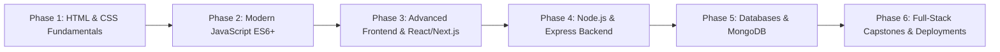

<div align="center">

# 🌐 Full Stack Web Development Journey
### *Comprehensive Code, Notes & Real-World Projects by Rahul*

[](https://developer.mozilla.org/en-US/docs/Web/HTML)
[](https://developer.mozilla.org/en-US/docs/Web/CSS)
[](https://developer.mozilla.org/en-US/docs/Web/JavaScript)
[](https://nodejs.org/)
[](https://expressjs.com/)
[](https://reactjs.org/)
[](https://nextjs.org/)
[](https://www.mongodb.com/)

<p align="center">
  <b>A modular, video-by-video roadmap from absolute web basics to production-ready full-stack engineering.</b>
</p>

[Explore Curriculum](#-curriculum-roadmap) • [Featured Projects](#-featured-projects) • [Getting Started](#-getting-started) • [Tech Stack](#-tech-stack)

---

</div>

## 📖 Overview

Welcome to my **Full Stack Web Development Repository**! This repository serves as a structured, hands-on archive of exercises, source code, interactive experiments, and capstone projects built during the Sigma Web Development journey.

Whether you are looking for reference implementations, quick snippets, or end-to-end full-stack architectures, this repository is organized video-by-video for seamless navigation.

---

## 🎯 What's Inside

- 📁 **130+ Modular Video Lessons:** Step-by-step code corresponding to each topic and lecture.
- 🎨 **Modern Frontend Practices:** Responsive web design, CSS Grid/Flexbox, animations, and Tailwind CSS.
- ⚡ **Modern JavaScript (ES6+):** Deep dives into DOM manipulation, Event Loop, Closures, Promises, and Async/Await.
- 🛠️ **Backend Architecture:** RESTful API design with Node.js & Express.js.
- 🗄️ **Database Persistence:** Document modeling, CRUD operations, and Mongoose schemas with MongoDB.
- 🚀 **Full-Stack Capstones:** Production-grade clones and interactive web applications (including Spotify Clone).

---

## 🗺️ Curriculum Roadmap



| Phase | Topics Covered | Key Folders |
| :--- | :--- | :--- |
| **01. Foundations** | HTML5 Semantics, Elements, Forms, Media, Tables | `Video 01` – `Video 15` |
| **02. CSS Mastery** | Selectors, Box Model, Flexbox, CSS Grid, Transitions, Media Queries | `Video 16` – `Video 53` |
| **03. JavaScript Engine** | Syntax, Loops, Functions, Arrays, Objects, DOM Manipulation, Events, Async/Await | `Video 54` – `Video 83` |
| **04. Capstone Projects** | Spotify Clone, Interactive Web Apps, Music Players | `Video 84+` |
| **05. Server-Side & APIs** | Node.js Runtime, NPM, Express.js Middleware, Routing, Template Engines | `Video 85` – `Video 105` |
| **06. Databases & ORM** | MongoDB Compass, Atlas, Mongoose Models, CRUD APIs | `Video 106` – `Video 115` |
| **07. Modern Frameworks** | React Components, State, Hooks, Next.js App Router, Full Stack Integration | `Video 116` – `Video 137` |

---

## 🚀 Featured Projects

### 🎵 Project: Spotify Web Player Clone
> **Location:** [`Video 84 - Project 2 - Spotify Clone`](file:///c:/Users/vallu/OneDrive/Desktop/Full%20stack%20projects/code_with_Rahul/Video%2084%20-%20Project%202%20-%20Spotify%20Clone)

- **Highlights:** Dynamic playlist rendering, custom audio player controls (play/pause, seekbar, volume control), responsive sidebar layout, and Spotify-inspired dark UI.
- **Tech Stack:** Vanilla JavaScript, HTML5 Audio API, Modern CSS3 Flexbox/Grid.

---

## 💻 Tech Stack

<div align="center">

| Category | Technologies & Tools |
| :--- | :--- |
| **Frontend** | HTML5, CSS3, JavaScript (ES6+), React.js, Next.js, Tailwind CSS |
| **Backend** | Node.js, Express.js, RESTful APIs |
| **Databases** | MongoDB, Mongoose ODM |
| **Tooling & Environment** | Git, GitHub, VS Code, Live Server, Postman, NPM |

</div>

---

## 📂 Repository Structure

```plaintext
code_with_Rahul/
├── Video 01/             # Introduction to Web Development & Setup
├── Video 02 - 15/        # HTML5 Core, Elements, Forms & Tables
├── Video 16 - 53/        # CSS3, Flexbox, Grid, Animations & Responsive Design
├── Video 54 - 83/        # JavaScript Essentials, DOM & Asynchronous Programming
├── Video 84 - Project/   # Capstone Project: Spotify Clone
├── Video 85 - 105/       # Node.js, NPM Packages & Express.js Backends
├── Video 106 - 115/      # Database Systems, MongoDB & Mongoose
├── Video 116 - 137/      # React.js & Next.js Modern Full Stack
└── README.md             # Project documentation
```

---

## ⚡ Getting Started

### 1. Clone the repository
```bash
git clone https://github.com/bunnyvalluri/Sigma-Web-Dev-Course.git
cd Sigma-Web-Dev-Course
```

### 2. Run a specific module / project
- **For Static / Frontend Lessons (HTML/CSS/JS):**
  - Open any folder (e.g., `Video 84 - Project 2 - Spotify Clone`)
  - Launch with **VS Code Live Server** or double-click `index.html`.

- **For Backend / Node.js Lessons:**
  ```bash
  cd "Video <Folder_Number>"
  npm install
  npm start # or node index.js
  ```

---

## 🤝 Connect & Feedback

Crafted with dedication by **Rahul**.  
Feel free to star ⭐ the repository if you find these resources helpful!

- 💻 **GitHub:** [@bunnyvalluri](https://github.com/bunnyvalluri)
- 💼 **LinkedIn:** [Connect on LinkedIn](https://linkedin.com/)

---

<div align="center">
  <sub>⭐️ Built for continuous learning & mastery in Full-Stack Web Engineering.</sub>
</div>
